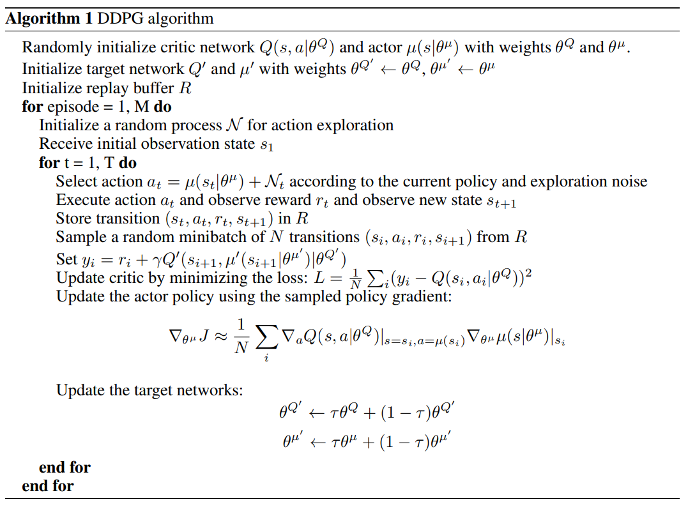
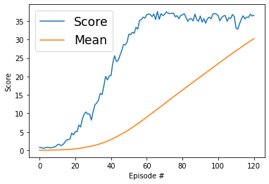

# Method
For the training of the agent, DDPG algorithm is used with the following settings:
- Replay buffer size = 1e5
- Mini batch size = 128
- Replay buffer with uniform sampling
- Learning rate for actor network: 1e-4
- Learning rate for critic network: 1e-4
- TAU to soft update of target parameters: 1e-3
- L2 weight decay: 0
- gamma: 0.99
- Maximum number of steps per episode = INF

# DQN ([Paper](https://arxiv.org/pdf/1509.02971.pdf))

The DDPG implementation is in [ddpg_agent.py](ddpg_agent.py).

# Neural Network Architecture
The model architecture is in [model.py](model.py). Both actor and critic networks consist of two fully connected layers with the size 128 and 128. The input and output for the actor network are state and action respectively. The inputs for the critic network are state and action and the output is 1 which shows the quality of chosen action in that state.

# Results
Here is the plot that shows the score and scores mean per window of the agent in different episodes. 

The agent is able to solve the environment in 121 episodes with an average score 30.23 in the last 100 episodes.

Episode 1	Single Agent Score: 0.72	Average Score: 0.72\
Episode 2	Single Agent Score: 0.76	Average Score: 0.74\
Episode 3	Single Agent Score: 0.49	Average Score: 0.66\
Episode 4	Single Agent Score: 0.63	Average Score: 0.65\
Episode 5	Single Agent Score: 0.84	Average Score: 0.69\
Episode 6	Single Agent Score: 0.76	Average Score: 0.70\
Episode 7	Single Agent Score: 0.63	Average Score: 0.69\
Episode 8	Single Agent Score: 0.77	Average Score: 0.70\
Episode 9	Single Agent Score: 0.85	Average Score: 0.72\
Episode 10	Single Agent Score: 1.02	Average Score: 0.75\
Episode 11	Single Agent Score: 1.49	Average Score: 0.82\
Episode 12	Single Agent Score: 1.63	Average Score: 0.88\
Episode 13	Single Agent Score: 1.24	Average Score: 0.91\
Episode 14	Single Agent Score: 1.51	Average Score: 0.95\
Episode 15	Single Agent Score: 2.04	Average Score: 1.03\
Episode 16	Single Agent Score: 2.76	Average Score: 1.13\
Episode 17	Single Agent Score: 2.88	Average Score: 1.24\
Episode 18	Single Agent Score: 3.05	Average Score: 1.34\
Episode 19	Single Agent Score: 4.62	Average Score: 1.51\
Episode 20	Single Agent Score: 4.15	Average Score: 1.64\
Episode 21	Single Agent Score: 5.04	Average Score: 1.80\
Episode 22	Single Agent Score: 5.01	Average Score: 1.95\
Episode 23	Single Agent Score: 6.81	Average Score: 2.16\
Episode 24	Single Agent Score: 6.31	Average Score: 2.33\
Episode 25	Single Agent Score: 8.54	Average Score: 2.58\
Episode 26	Single Agent Score: 9.79	Average Score: 2.86\
Episode 27	Single Agent Score: 10.39	Average Score: 3.14\
Episode 28	Single Agent Score: 9.79	Average Score: 3.38\
Episode 29	Single Agent Score: 9.86	Average Score: 3.60\
Episode 30	Single Agent Score: 8.16	Average Score: 3.75\
Episode 31	Single Agent Score: 10.48	Average Score: 3.97\
Episode 32	Single Agent Score: 12.32	Average Score: 4.23\
Episode 33	Single Agent Score: 12.79	Average Score: 4.49\
Episode 34	Single Agent Score: 13.62	Average Score: 4.76\
Episode 35	Single Agent Score: 15.40	Average Score: 5.06\
Episode 36	Single Agent Score: 15.10	Average Score: 5.34\
Episode 37	Single Agent Score: 17.44	Average Score: 5.67\
Episode 38	Single Agent Score: 20.04	Average Score: 6.05\
Episode 39	Single Agent Score: 19.05	Average Score: 6.38\
Episode 40	Single Agent Score: 20.13	Average Score: 6.72\
Episode 41	Single Agent Score: 20.22	Average Score: 7.05\
Episode 42	Single Agent Score: 23.63	Average Score: 7.45\
Episode 43	Single Agent Score: 25.60	Average Score: 7.87\
Episode 44	Single Agent Score: 24.10	Average Score: 8.24\
Episode 45	Single Agent Score: 24.30	Average Score: 8.59\
Episode 46	Single Agent Score: 25.69	Average Score: 8.97\
Episode 47	Single Agent Score: 26.96	Average Score: 9.35\
Episode 48	Single Agent Score: 28.65	Average Score: 9.75\
Episode 49	Single Agent Score: 28.56	Average Score: 10.14\
Episode 50	Single Agent Score: 29.26	Average Score: 10.52\
Episode 51	Single Agent Score: 31.45	Average Score: 10.93\
Episode 52	Single Agent Score: 31.34	Average Score: 11.32\
Episode 53	Single Agent Score: 31.96	Average Score: 11.71\
Episode 54	Single Agent Score: 31.70	Average Score: 12.08\
Episode 55	Single Agent Score: 33.33	Average Score: 12.47\
Episode 56	Single Agent Score: 32.82	Average Score: 12.83\
Episode 57	Single Agent Score: 35.20	Average Score: 13.22\
Episode 58	Single Agent Score: 35.41	Average Score: 13.61\
Episode 59	Single Agent Score: 36.08	Average Score: 13.99\
Episode 60	Single Agent Score: 35.80	Average Score: 14.35\
Episode 61	Single Agent Score: 36.73	Average Score: 14.72\
Episode 62	Single Agent Score: 36.93	Average Score: 15.07\
Episode 63	Single Agent Score: 36.79	Average Score: 15.42\
Episode 64	Single Agent Score: 36.20	Average Score: 15.74\
Episode 65	Single Agent Score: 36.92	Average Score: 16.07\
Episode 66	Single Agent Score: 35.42	Average Score: 16.36\
Episode 67	Single Agent Score: 37.62	Average Score: 16.68\
Episode 68	Single Agent Score: 35.47	Average Score: 16.96\
Episode 69	Single Agent Score: 37.02	Average Score: 17.25\
Episode 70	Single Agent Score: 36.51	Average Score: 17.52\
Episode 71	Single Agent Score: 36.79	Average Score: 17.79\
Episode 72	Single Agent Score: 37.49	Average Score: 18.07\
Episode 73	Single Agent Score: 37.14	Average Score: 18.33\
Episode 74	Single Agent Score: 37.03	Average Score: 18.58\
Episode 75	Single Agent Score: 37.08	Average Score: 18.83\
Episode 76	Single Agent Score: 37.17	Average Score: 19.07\
Episode 77	Single Agent Score: 36.18	Average Score: 19.29\
Episode 78	Single Agent Score: 36.47	Average Score: 19.51\
Episode 79	Single Agent Score: 35.64	Average Score: 19.72\
Episode 80	Single Agent Score: 36.53	Average Score: 19.93\
Episode 81	Single Agent Score: 36.67	Average Score: 20.13\
Episode 82	Single Agent Score: 37.01	Average Score: 20.34\
Episode 83	Single Agent Score: 35.99	Average Score: 20.53\
Episode 84	Single Agent Score: 34.95	Average Score: 20.70\
Episode 85	Single Agent Score: 35.61	Average Score: 20.87\
Episode 86	Single Agent Score: 35.65	Average Score: 21.05\
Episode 87	Single Agent Score: 35.04	Average Score: 21.21\
Episode 88	Single Agent Score: 36.90	Average Score: 21.39\
Episode 89	Single Agent Score: 35.41	Average Score: 21.54\
Episode 90	Single Agent Score: 34.97	Average Score: 21.69\
Episode 91	Single Agent Score: 36.37	Average Score: 21.85\
Episode 92	Single Agent Score: 34.72	Average Score: 21.99\
Episode 93	Single Agent Score: 35.64	Average Score: 22.14\
Episode 94	Single Agent Score: 34.42	Average Score: 22.27\
Episode 95	Single Agent Score: 35.63	Average Score: 22.41\
Episode 96	Single Agent Score: 36.06	Average Score: 22.55\
Episode 97	Single Agent Score: 35.61	Average Score: 22.69\
Episode 98	Single Agent Score: 36.90	Average Score: 22.83\
Episode 99	Single Agent Score: 37.04	Average Score: 22.98\
Episode 100	Single Agent Score: 36.87	Average Score: 23.12\
Episode 101	Single Agent Score: 36.48	Average Score: 23.47\
Episode 102	Single Agent Score: 35.07	Average Score: 23.82\
Episode 103	Single Agent Score: 36.00	Average Score: 24.17\
Episode 104	Single Agent Score: 36.40	Average Score: 24.53\
Episode 105	Single Agent Score: 36.50	Average Score: 24.89\
Episode 106	Single Agent Score: 34.93	Average Score: 25.23\
Episode 107	Single Agent Score: 35.90	Average Score: 25.58\
Episode 108	Single Agent Score: 35.70	Average Score: 25.93\
Episode 109	Single Agent Score: 36.78	Average Score: 26.29\
Episode 110	Single Agent Score: 36.26	Average Score: 26.64\
Episode 111	Single Agent Score: 33.14	Average Score: 26.96\
Episode 112	Single Agent Score: 32.81	Average Score: 27.27\
Episode 113	Single Agent Score: 34.30	Average Score: 27.60\
Episode 114	Single Agent Score: 35.54	Average Score: 27.94\
Episode 115	Single Agent Score: 36.45	Average Score: 28.28\
Episode 116	Single Agent Score: 35.57	Average Score: 28.61\
Episode 117	Single Agent Score: 36.11	Average Score: 28.95\
Episode 118	Single Agent Score: 36.00	Average Score: 29.27\
Episode 119	Single Agent Score: 36.87	Average Score: 29.60\
Episode 120	Single Agent Score: 36.39	Average Score: 29.92\
Episode 121	Single Agent Score: 36.55	Average Score: 30.23

# Future works
- To use prioritized experience replay to gain more from valuable replays.
- To implement other actor-critic methods such as PPO, A2C, A3C, D4PG, and etc. for this environment.
- To implement shared network architecture.

